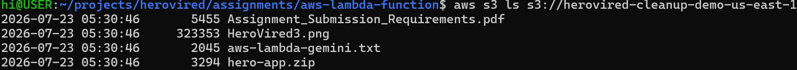
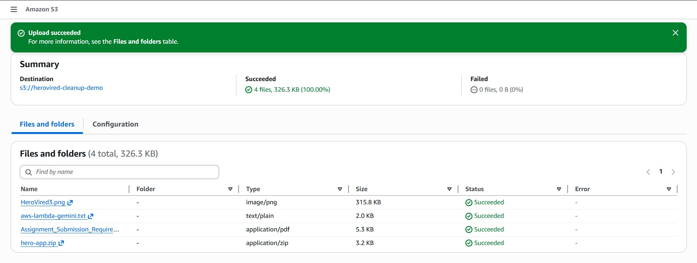
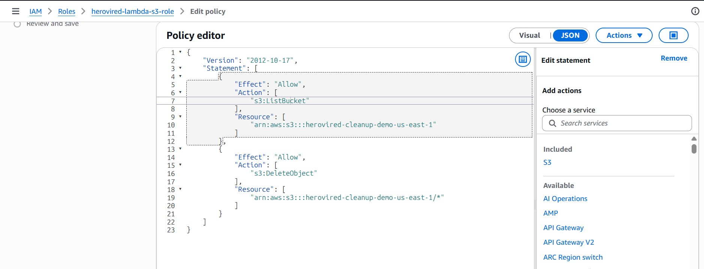
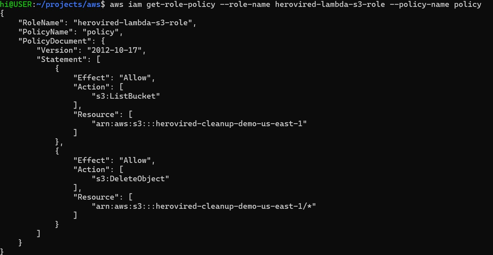
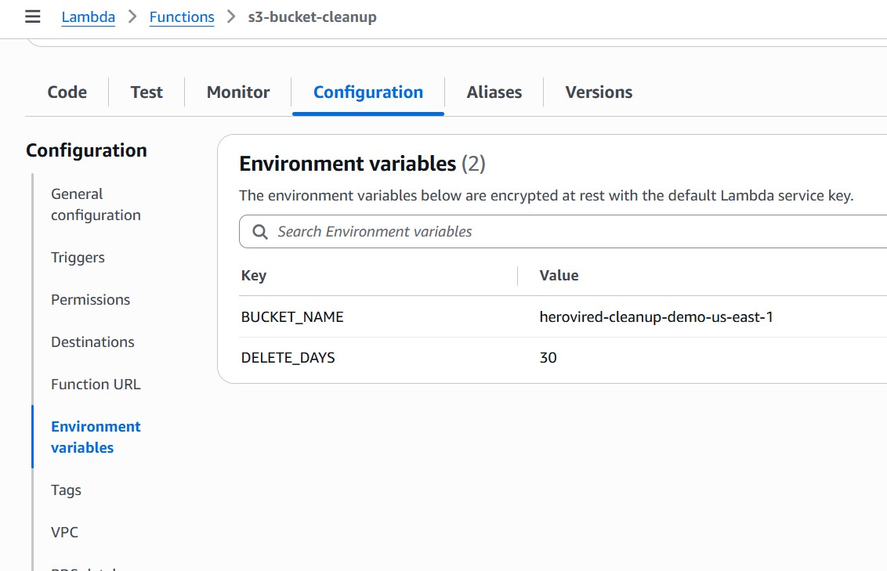
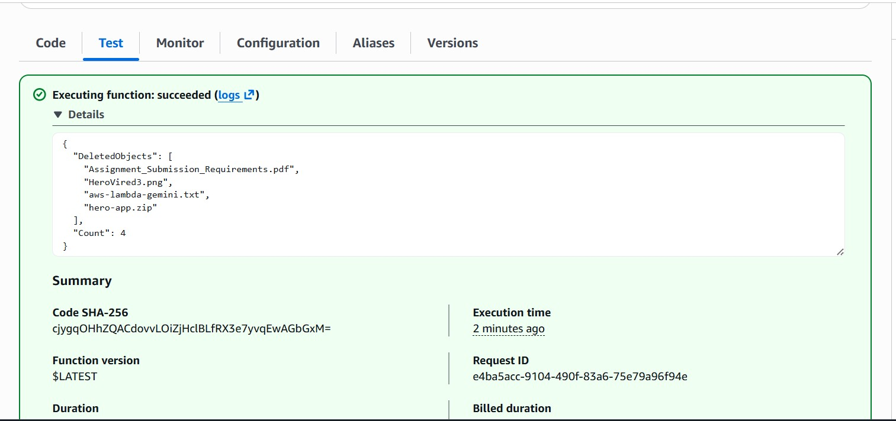
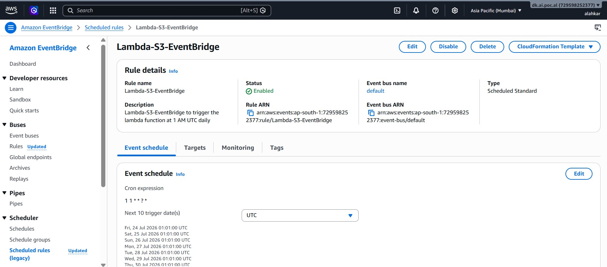

# Assignment I - Automated S3 Bucket Cleanup using AWS Lambda

## Objective

Automatically delete objects older than a configured number of days from an Amazon S3 bucket using AWS Lambda, Boto3, and EventBridge Scheduler.

---

## AWS Services Used

- AWS Lambda
- Amazon S3
- Amazon EventBridge Scheduler
- IAM
- Amazon CloudWatch
- Boto3 (Python SDK)

---

## Environment

| Item | Value |
|------|------|
| AWS Region | us-east-1 |
| Bucket | `herovired-cleanup-demo-us-east-1` |
| Lambda Runtime | Python 3.12 |
| IAM Role | `herovired-lambda-s3-role` |

---

# Solution Overview

The Lambda function performs the following tasks:

1. Reads the bucket name from Lambda Environment Variables.
2. Lists all objects inside the bucket.
3. Checks each object's age.
4. Deletes objects older than the configured retention period.
5. Logs every action to CloudWatch.
6. Executes automatically every day using EventBridge Scheduler.

The following environment variables are configured outside the Lambda code:

| Variable | Purpose |
|----------|----------|
| `BUCKET_NAME` | S3 bucket to scan |
| `DELETE_DAYS` | Delete objects older than this many days |

---

# IAM Permissions

The Lambda execution role contains:

## AWS Managed Policy

- AWSLambdaBasicExecutionRole

Provides:

- CloudWatch logging

## Inline Policy

The custom inline policy grants only the minimum permissions required:

- `s3:ListBucket`
- `s3:DeleteObject`

This follows the Principle of Least Privilege.

---

# Why Lambda Instead of S3 Lifecycle?

Amazon S3 Lifecycle Rules are the preferred solution for simple age-based object deletion because:

- No code to maintain
- No Lambda execution cost
- Native AWS feature
- Easy to configure

However, Lambda becomes useful when deletion depends on custom business logic, for example:

- Delete only `*.tmp`
- Delete only `backup-*`
- Delete files older than 30 days **AND** smaller than 1 MB
- Notify users after deletion
- Update a database
- Trigger another AWS service
- Cross-service automation

Boto3 integrates directly with Lambda using IAM Roles, eliminating the need to manage AWS credentials inside the code.

---

# Implementation Steps

## Step 1 - Create S3 Bucket

Create the bucket:

`herovired-cleanup-demo-us-east-1`

### Screenshot



---

## Step 2 - Upload Test Files

Upload a few sample files into the bucket.

### Screenshot



---

## Step 3 - Create IAM Role

Create the IAM Role:

`herovired-lambda-s3-role`

Attach:

- AWSLambdaBasicExecutionRole
- Custom inline policy for S3 List/Delete access

### Screenshot



CLI policy verification:



---

## Step 4 - Create Lambda Function

Create the Lambda function.

Configure the following Environment Variables:

- `BUCKET_NAME`
- `DELETE_DAYS`

### Screenshot



---

## Step 5 - Test the Lambda Function

Invoke the function manually.

Verify:

- CloudWatch Logs
- Deleted objects
- Remaining objects

### Screenshot



---

## Step 6 - Automate with EventBridge Scheduler

Create an EventBridge Schedule.

Configuration:

- Trigger: Daily
- Time: **01:00 UTC**
- Target: Lambda Function

### Screenshot



---

# Final Lambda Function

The final source code is available in:

```
lambda_function.py
```

---

# Repository Structure

```
I-Automated-S3-Cleanup
│
├── lambda_function.py
├── README.md
└── Screenshots
    ├── Bucket_list_Files.jpg
    ├── IAM-Role-lambda-s3-list-delete-object.jpg
    ├── IAM-Role-lambda-s3-list-delete-object-cli.jpg
    ├── Lambda-Environment_variables.jpg
    ├── Lambda_S3_EventBridge_Schedule_1AM_UTC.jpg
    ├── S3-Upload_Files.jpg
    └── lambda_function_execution_manually.jpg
```

---

# Learning Outcomes

Through this assignment, I learned:

- AWS Lambda development using Python
- Using the AWS Boto3 SDK
- IAM Roles and least-privilege policies
- Lambda Environment Variables
- Amazon S3 object management
- CloudWatch logging
- EventBridge Scheduler automation
- Building serverless automation workflows

---

# References

- AWS Lambda
- Amazon S3
- Amazon EventBridge Scheduler
- AWS IAM
- Boto3 (Python SDK)