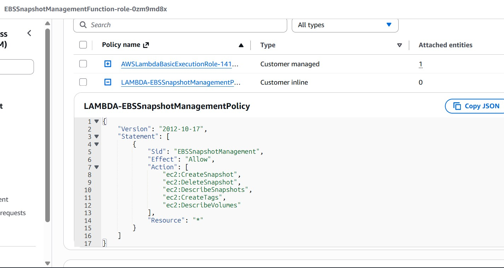
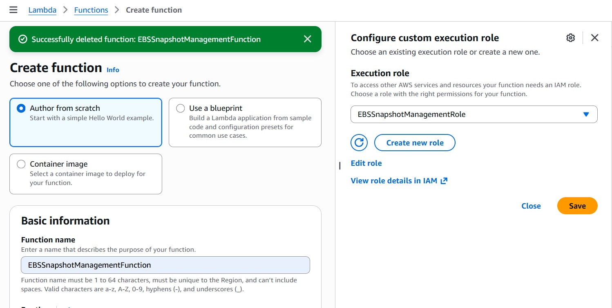
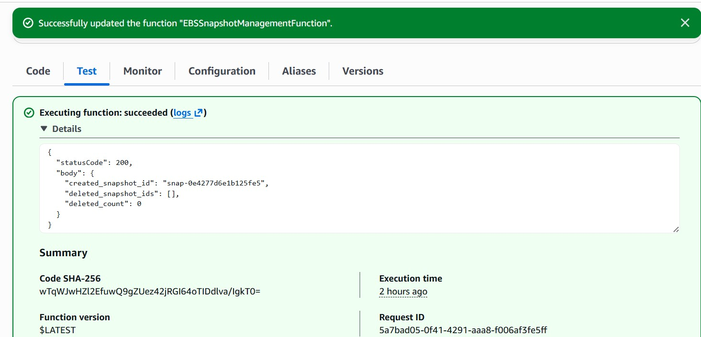
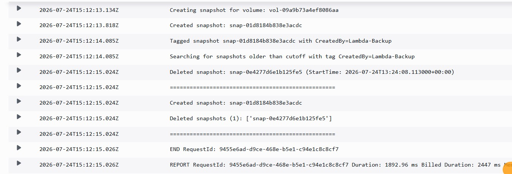
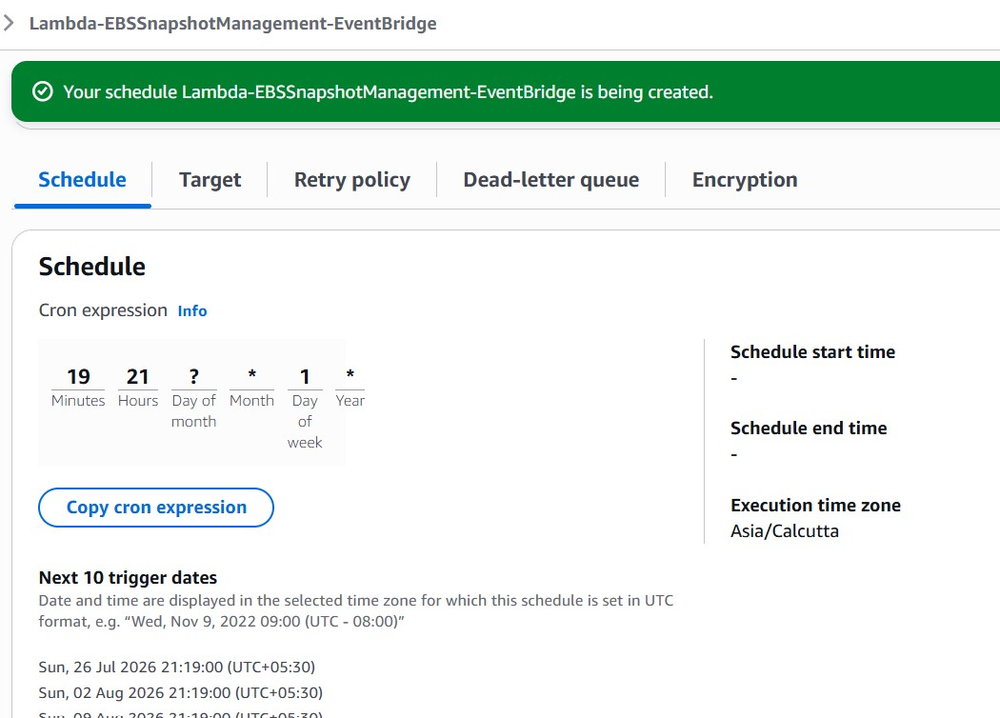
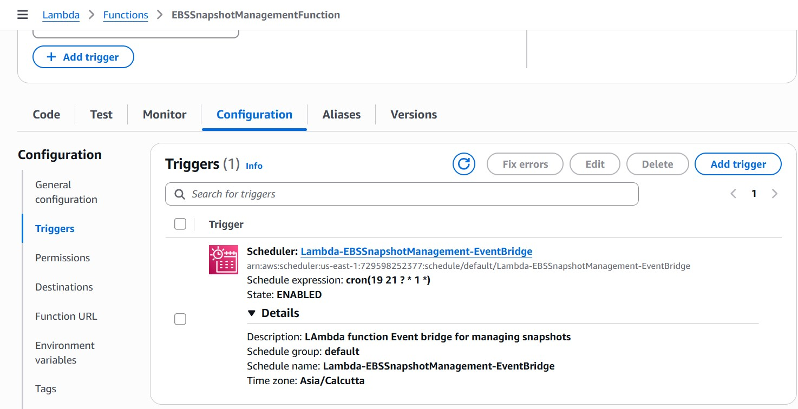
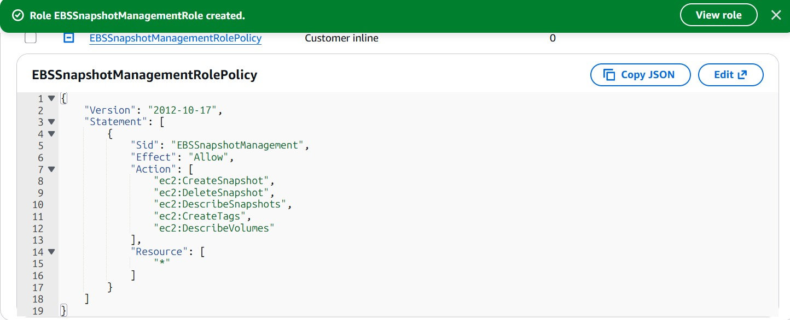

# AWS Automation with Lambda & Boto3 – Assignment II

# Automated EBS Snapshot Create & Cleanup using AWS Lambda

## Objective

Automate the creation and cleanup of Amazon EBS snapshots using AWS Lambda, Boto3, and EventBridge. The Lambda function creates a snapshot for a specified EBS volume, tags it, removes snapshots older than the configured retention period, and runs automatically on a weekly schedule.

---

## AWS Resources

| Resource | Value |
|----------|-------|
| Region | us-east-1 |
| Lambda Function | EBSSnapshotManagementFunction |
| IAM Role | EBSSnapshotManagementRole |
| Lambda Execution Role | EBSSnapshotManagementFunction-role-0zm9md8x |
| Inline Policy | LAMBDA-EBSSnapshotManagementPolicy |
| Runtime | Python 3.12 |
| AWS SDK | boto3 |
| EBS Volume | vol-09a9b73a4ef8086aa |

---

# Discussion

Amazon **Data Lifecycle Manager (DLM)** is the preferred AWS managed service for creating and deleting EBS snapshots on a schedule. It requires no custom code and is recommended for standard backup retention requirements.

AWS Lambda becomes a better solution when additional business logic is required, such as:

- Custom retention policies (daily, weekly, monthly)
- Snapshot volumes based on tags
- Cross-account or cross-region snapshot copies
- SNS, Slack or Email notifications
- Triggering Step Functions or other downstream workflows
- Integration with CMDB or ITSM systems
- Conditional backup logic based on application requirements

Since Lambda uses the AWS SDK for Python (**boto3**), it securely accesses AWS resources through IAM Roles without storing AWS credentials inside the code.

---

# Solution Workflow

```
Amazon EventBridge
        │
        ▼
AWS Lambda
        │
        ├── Create Snapshot
        ├── Tag Snapshot
        └── Delete Expired Snapshots
                │
                ▼
            Amazon EBS
```

---

# Environment Variables

The final version removes hardcoded values from the Python source.

| Variable | Description |
|----------|-------------|
| VOLUME_ID | EBS Volume ID to back up |
| RETENTION_DAYS | Number of days to retain snapshots |

Example

```
VOLUME_ID=vol-09a9b73a4ef8086aa

RETENTION_DAYS=30
```

---

# IAM Permissions

A dedicated inline IAM policy named

```
LAMBDA-EBSSnapshotManagementPolicy
```

was attached to the Lambda execution role.

The policy grants permission to:

- ec2:CreateSnapshot
- ec2:DeleteSnapshot
- ec2:DescribeSnapshots
- ec2:CreateTags
- ec2:DescribeVolumes

The AWS managed policy

```
AWSLambdaBasicExecutionRole
```

was also attached to enable CloudWatch logging.

---

# Implementation Steps

## Step 1 – Create Lambda Function

Create a Python 3.12 Lambda function named

```
EBSSnapshotManagementFunction
```

Allow AWS to create a new execution role during Lambda creation.

---

## Step 2 – Create IAM Policy

Create the inline IAM policy

```
LAMBDA-EBSSnapshotManagementPolicy
```

Attach the policy to the Lambda execution role.

### Screenshot



---

## Step 3 – Configure Lambda

Initially the following values were hardcoded inside the Lambda function for testing:

- VOLUME_ID
- RETENTION_DAYS

During development, the retention period was temporarily changed to **RETENTION_MINS** to verify automatic cleanup without waiting several days.

After successful validation, both values were moved to Lambda Environment Variables.

### Screenshot



---

## Step 4 – Manual Test

Invoke the Lambda function manually.

Expected outcome:

- New snapshot created
- Snapshot tagged successfully

### Screenshot



---

## Step 5 – Verify Cleanup

After the retention period expires, invoke the Lambda function again.

Expected outcome:

- New snapshot created
- Previous snapshot automatically deleted

CloudWatch logs confirm both operations.

### Screenshot



---

## Step 6 – Schedule Automatic Execution

Create an Amazon EventBridge Schedule named

```
Lambda-EBSSnapshotManagement-EventBridge
```

Configuration:

- Weekly
- Sunday
- 9:19 PM IST

### Screenshot



---

## Step 7 – Verify Event Trigger

After the scheduled execution time, verify that EventBridge successfully invokes the Lambda function.

CloudWatch logs confirm the scheduled execution.

### Screenshot



---

# Repository Structure

```
II-EBSSnapshot-Create-Cleanup/
│
├── lambda_function.py
├── README.md
└── Snapshots
    ├── EBS-SNAPSHOT-MANAGEMENT-LAMBDA-FUNCTION.jpg
    ├── EBS-SNAPSHOT-MANAGEMENT-Role.jpg
    ├── EventTriggerInLambdaFunction.jpg
    ├── Lambda-EBSSnapshotManagement-EventBridgeSchedule.jpg
    ├── Lambda-EBSSnapshotManagement-FirstRunTestResult.jpg
    ├── Lambda-EBSSnapshotManagement-SecondRunTestResult.jpg
    └── Lambda-EBSSnapshotManagementPolicy.jpg
```

---

# Screenshots

## Lambda Function


---

## IAM Role



---

## IAM Inline Policy


---

## First Manual Test


---

## Automatic Cleanup Verification


---

## EventBridge Schedule


---

## Lambda Triggered by EventBridge


---

# Learning Outcomes

- Amazon EBS snapshot automation using AWS Lambda
- Managing EBS snapshots with Boto3
- Using IAM least-privilege policies
- Configuring Lambda Environment Variables
- Snapshot tagging using EC2 APIs
- CloudWatch logging and monitoring
- Automated snapshot cleanup
- EventBridge scheduled execution
- Serverless backup automation