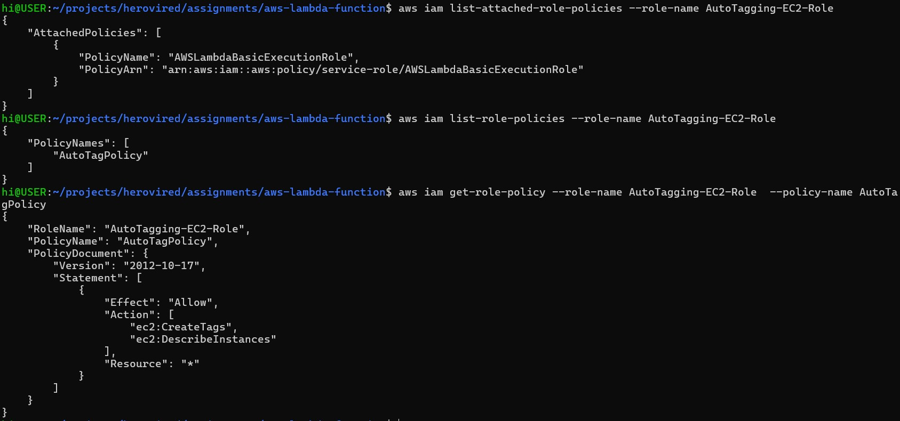
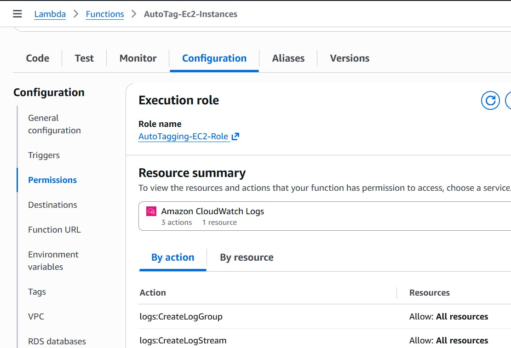
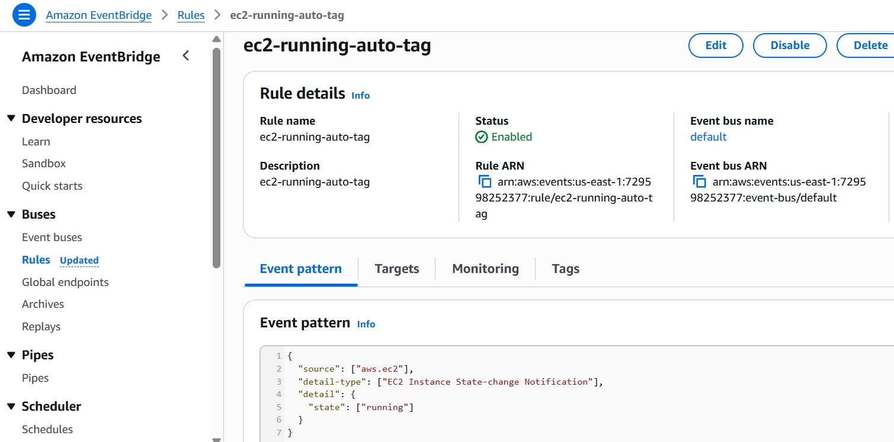
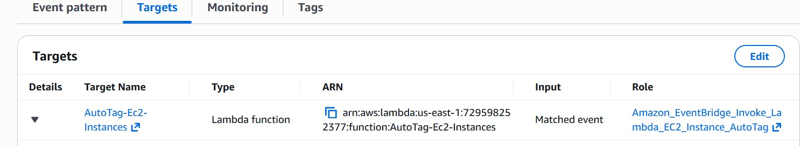
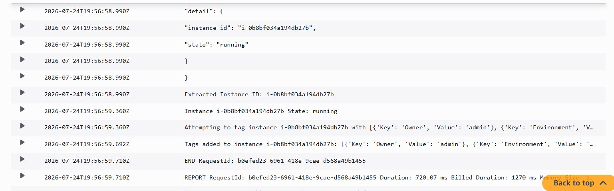
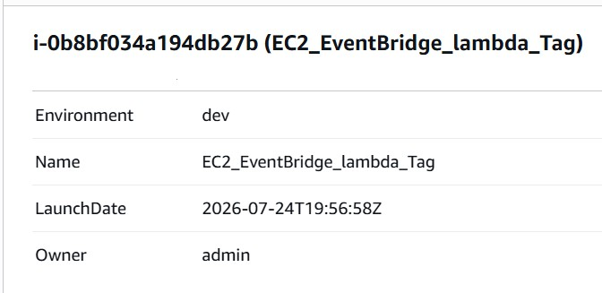

# III. Auto-Tagging EC2 Instances on Launch

**Objective:** Automatically tag newly launched EC2 instances for resource tracking, ownership, and cost allocation.

**Region:** `us-east-1`

---

## Overview

This Lambda function is triggered by Amazon EventBridge when an EC2 instance enters the `running` state. It extracts the instance ID from the event and applies standard tags (`LaunchDate`, `Owner`, `Environment`) for resource tracking and cost allocation.

---

## Architecture

```
EC2 Instance State Change (running)
    ↓
Amazon EventBridge Rule
    ↓
AWS Lambda (AutoTag-Ec2-Instances)
    ↓
EC2 CreateTags API
```

---

## Prerequisites

- AWS CLI configured (optional, for CLI commands)
- An EC2 instance to test with (or ability to launch one)
- Access to the AWS Management Console for IAM, Lambda, EventBridge, and EC2

---

## Step 1: IAM Role

**Role Name:** `AutoTagging-EC2-Role`

**Trusted Entity:** `lambda.amazonaws.com`

**Managed Policies:**
- `AWSLambdaBasicExecutionRole` — Grants CloudWatch Logs access

**Inline Policy:** `EC2Tagging`

```json
{
    "Version": "2012-10-17",
    "Statement": [
        {
            "Sid": "EC2Tagging",
            "Effect": "Allow",
            "Action": [
                "ec2:CreateTags",
                "ec2:DescribeInstances"
            ],
            "Resource": "*"
        }
    ]
}
```

> **Note:** `ec2:CreateTags` does not support resource-level permissions during instance launch, so `Resource: "*"` is standard and required.



---

## Step 2: Lambda Function

**Function Name:** `AutoTag-Ec2-Instances`  
**Runtime:** Python 3.12  
**Handler:** `lambda_function.lambda_handler`  
**Execution Role:** `AutoTagging-EC2-Role`

**Environment Variables:**

| Key | Example Value | Description |
|-----|---------------|-------------|
| `OWNER` | `DevOps-Team` | Default owner tag applied to instances |
| `ENVIRONMENT` | `production` | Environment identifier (dev, staging, production) |

### Source Code

The complete source code is available in [`lambda_function.py`](lambda_function.py).

```python
import json
import os
from datetime import datetime, timezone

import boto3

ec2 = boto3.client("ec2")

OWNER = os.environ.get("OWNER", "admin")
ENVIRONMENT = os.environ.get("ENVIRONMENT", "dev")


def extract_instance_id(event):
    """Pull the instance ID from the EventBridge event payload."""
    instance_id = event.get("detail", {}).get("instance-id")
    if not instance_id:
        raise ValueError("Event missing detail.instance-id")
    return instance_id


def build_tags():
    """Build the tag dictionary for the instance."""
    return [
        {
            "Key": "LaunchDate",
            "Value": datetime.now(timezone.utc).strftime("%Y-%m-%d"),
        },
        {"Key": "Owner", "Value": OWNER},
        {"Key": "Environment", "Value": ENVIRONMENT},
        {"Key": "AutoTagged", "Value": "true"},
    ]


def tag_instance(instance_id, tags):
    """Apply the tag set to the EC2 instance."""
    ec2.create_tags(Resources=[instance_id], Tags=tags)
    print(f"Tagged instance {instance_id} with: {tags}")


def lambda_handler(event, context):
    """Orchestrates extraction, tag building, and tagging."""
    print(json.dumps(event, indent=2))

    instance_id = extract_instance_id(event)
    tags = build_tags()
    tag_instance(instance_id, tags)

    return {
        "statusCode": 200,
        "body": {
            "instance_id": instance_id,
            "applied_tags": tags,
        },
    }
```



---

## Step 3: EventBridge Rule

**Rule Name:** `ec2-running-auto-tag`

**Event Pattern:**

```json
{
  "source": ["aws.ec2"],
  "detail-type": ["EC2 Instance State-change Notification"],
  "detail": {
    "state": ["running"]
  }
}
```

**Target:** Lambda function `AutoTag-Ec2-Instances`

### AWS CLI Commands

```bash
# Create the EventBridge rule
aws events put-rule \
  --name "ec2-running-auto-tag" \
  --event-pattern '{"source":["aws.ec2"],"detail-type":["EC2 Instance State-change Notification"],"detail":{"state":["running"]}}' \
  --state ENABLED

# Allow EventBridge to invoke the Lambda
aws lambda add-permission \
  --function-name AutoTag-Ec2-Instances \
  --statement-id EventBridgeEC2Tagging \
  --action lambda:InvokeFunction \
  --principal events.amazonaws.com \
  --source-arn arn:aws:events:us-east-1:ACCOUNT_ID:rule/ec2-running-auto-tag

# Attach the Lambda as the rule target
aws events put-targets \
  --rule "ec2-running-auto-tag" \
  --targets "Id=1,Arn=arn:aws:lambda:us-east-1:ACCOUNT_ID:function:AutoTag-Ec2-Instances"
```





---

## Step 4: Testing

### 4.1 Manual Test Event

Use this EventBridge-shaped test event in the Lambda console to verify the function logic without launching an instance:

```json
{
  "version": "0",
  "id": "12345678-1234-1234-1234-123456789012",
  "detail-type": "EC2 Instance State-change Notification",
  "source": "aws.ec2",
  "account": "123456789012",
  "time": "2026-07-25T12:00:00Z",
  "region": "us-east-1",
  "detail": {
    "instance-id": "i-0123456789abcdef0",
    "state": "running"
  }
}
```

### 4.2 Real Integration Test

1. Launch a new EC2 instance (or stop and start an existing one).
2. Wait for the instance to reach the `running` state.
3. Check **CloudWatch Logs** for the Lambda execution output:



4. Open the **EC2 Console** → select the instance → **Tags** tab and verify:



**Expected Tags:**

| Tag Key | Example Value |
|---------|---------------|
| `LaunchDate` | `2026-07-25` |
| `Owner` | `DevOps-Team` (from env var) |
| `Environment` | `production` (from env var) |
| `AutoTagged` | `true` |

---

## Discussion: AWS Systems Manager vs. Custom Lambda

**AWS Systems Manager (SSM) and AWS Config** offer native tagging policies that can enforce and auto-apply tags across resources organization-wide.

**However, a custom Lambda approach is preferred when you need:**

- **Custom logic** — Deriving the `Owner` from the IAM principal who launched the instance (via CloudTrail lookup), applying tags based on instance metadata, naming conventions, or subnet/VPC placement.
- **Cross-service actions** — Writing tag metadata to a DynamoDB inventory table, sending notifications to Slack/Teams, or triggering downstream Step Functions workflows after tagging.
- **Immediate consistency** — EventBridge triggers the Lambda within seconds of the state change, whereas native policy engines may have evaluation delays of several minutes.

---

## File Structure

```
III-AutoTag-EC2-Instances/
├── lambda_function.py          # Lambda source code
├── README.md                   # This documentation
└── Screenshots/
    ├── AutoTag-Ec2-EventBridge-Rule.jpg
    ├── AutoTag-Ec2-EventBridge-Target.jpg
    ├── AutoTag-Ec2-Running-Instances-byEventBridgeTrigger.jpg
    ├── AutoTag-IAM-Role-inlinePolicy.jpg
    ├── AutoTag-LambdaFunction-ExecutionRule.jpg
    └── Instance-Tag_verified.jpg
```

---

## References

- [GitHub Repository — AutoTag-Ec2-Instance.py](https://github.com/AmarGmail/herovired-lambda-demo/blob/main/AutoTag-Ec2-Instance.py)
- [Boto3 EC2 — create_tags](https://boto3.amazonaws.com/v1/documentation/api/latest/reference/services/ec2/client/create_tags.html)
- [Amazon EventBridge — EC2 Instance State-change Events](https://docs.aws.amazon.com/AmazonCloudWatch/latest/events/EventTypes.html#ec2_event_type)
