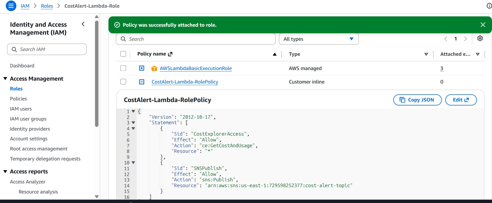
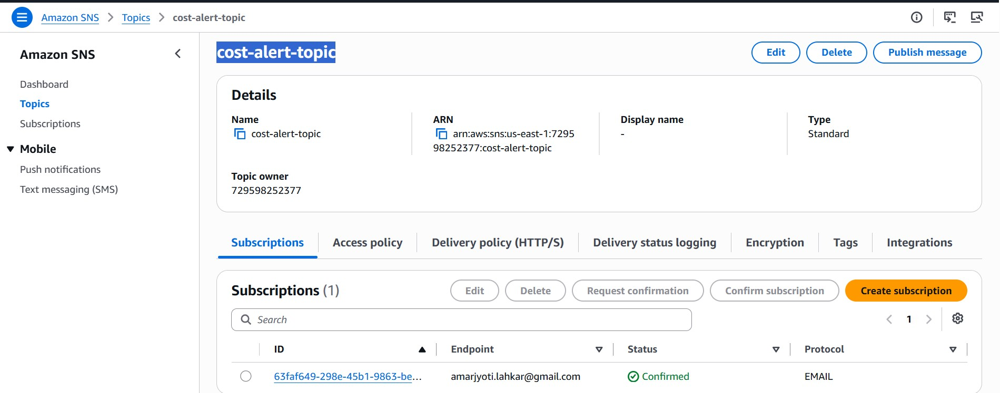
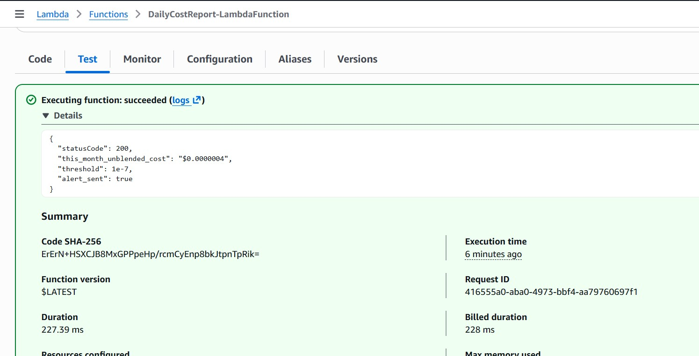
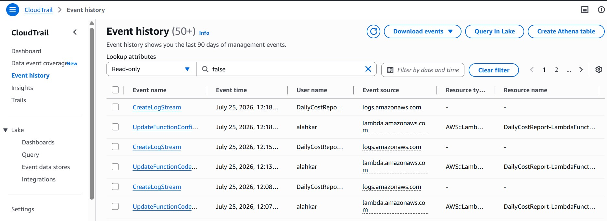
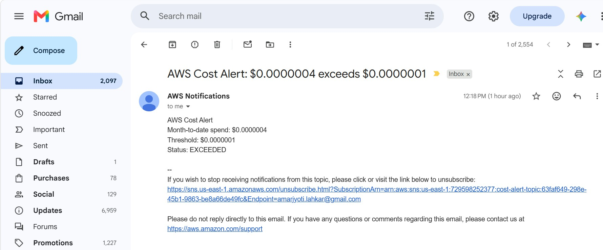

# IV - Daily AWS Cost Report Using Cost Explorer API and SNS

## Objective

Automate daily AWS cost monitoring using **AWS Lambda**, **AWS Cost Explorer**, **Amazon SNS**, and **Amazon EventBridge**.

The Lambda function retrieves the current month's AWS **Unblended Cost**, compares it against a configurable threshold, and sends an email notification through Amazon SNS when the threshold is exceeded.

---

# AWS Services Used

- AWS Lambda
- AWS Cost Explorer API
- Amazon SNS
- Amazon EventBridge Scheduler
- Amazon CloudWatch Logs
- IAM

---

# Features

- Retrieves Month-to-Date AWS Cost
- Uses Cost Explorer API
- Configurable cost threshold
- Sends SNS email notification
- Daily scheduled execution using EventBridge
- Detailed CloudWatch logging
- Uses Lambda Environment Variables

---

# IAM Permissions

The Lambda execution role requires:

```
ce:GetCostAndUsage
sns:Publish
logs:CreateLogGroup
logs:CreateLogStream
logs:PutLogEvents
```

The SNS Publish permission should be scoped to the SNS Topic ARN.

---

# Environment Variables
```
| Variable | Description |
|-----------|-------------|
| SNS_TOPIC_ARN | arn:aws:sns:us-east-1:729598252377:cost-alert-topic |
| THRESHOLD | 0.0000001 |
```

---

# Lambda Workflow

1. Triggered manually or by EventBridge.
2. Query AWS Cost Explorer.
3. Retrieve Month-to-Date Unblended Cost.
4. Compare cost against threshold.
5. If threshold exceeded:
   - Publish message to SNS.
   - Email notification sent.
6. Log execution details to CloudWatch.

---

# EventBridge Schedule

Example schedule:

```
Rate: 1 day
```

or

```
Cron: Every day at 09:00 UTC
```

---

# Testing

## Manual Test

Set a very low threshold.

```
THRESHOLD=0.0000001
```

Invoke the Lambda manually.

 Output:

```
{
  "statusCode": 200,
  "this_month_unblended_cost": "$0.0000004",
  "threshold": 1e-7,
  "alert_sent": true
}
```

---

# CloudWatch Logs

CloudWatch captures:

- Cost Explorer response
- Current month cost
- Configured threshold
- SNS publish status
- SNS MessageId
- Exceptions

---

# Screenshots

# Screenshots

## 1. IAM Role and Inline Policy



---

## 2. SNS Topic and Email Subscription



---

## 3. Lambda Function Test



---

## 4. CloudWatch Logs



---

## 5. Email




All screenshots are available under:

```
Screenshots/
```

---

# Assignment Structure

```
IV-Daily-Cost-Report/
│
├── lambda_function.py
├── README.md
└── Screenshots/
    ├── DailyCostReport-IAMRole-AWSLambdaBasicExecutionRole-InlinePolicy.jpg
    ├── DailyCostReport-SNS-Topic-SubscriptionConfirmation.jpg
    ├── DailyCostReport-Lambda_test_run.jpg
    └── DailyCostReport-CloudTraillSNSTpoic_EmailLogs.jpg
    └── DailyCostReport-EmailNotification.jpg
```

---

# Discussion

AWS provides **AWS Budgets** as a managed service for cost monitoring and alerts.

Managed Alternative: AWS Budgets can automatically monitor AWS spending and send notifications when predefined thresholds are exceeded, requiring little to no custom code.

Why use Lambda instead? Lambda provides greater flexibility for implementing custom business logic, such as sending alerts based on specific AWS services, applying anomaly detection, integrating with Slack or Microsoft Teams, or triggering automated remediation workflows in response to spending patterns.

---

# Notes

While testing on a Free Tier account with promotional credits, the AWS Billing dashboard displayed approximately **$10.16** in estimated usage, whereas the Cost Explorer API returned an **UnblendedCost** close to **$0.00** because promotional credits offset the actual billable amount. This behavior is expected and demonstrates the difference between usage costs and billable charges.

---
